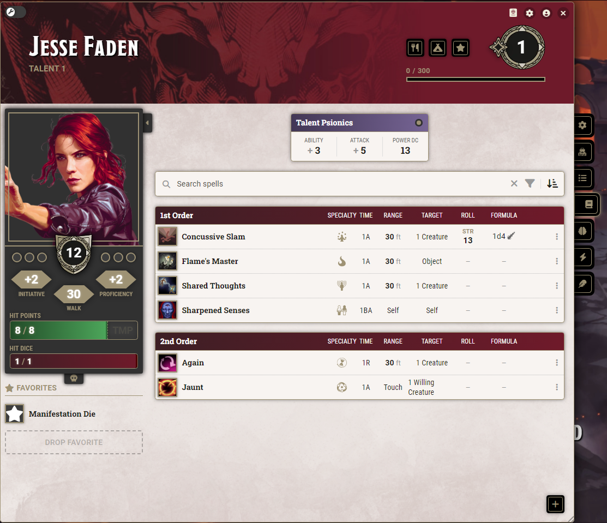
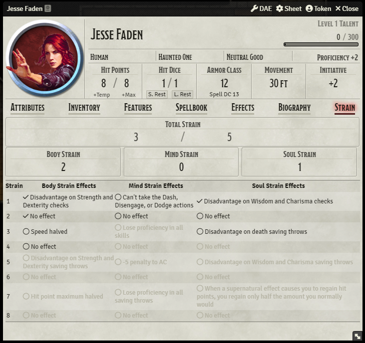
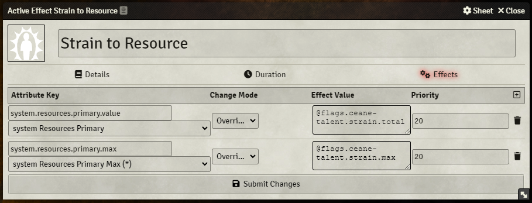
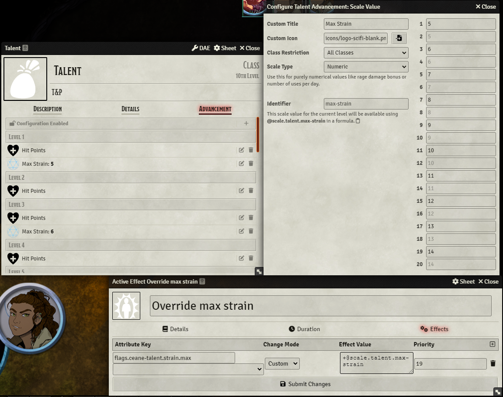

# Talent Character Sheet Support for D&D 5e

This module adds character sheet support for The Talent class from [MCDM's The Talent and Psionics](https://mcdm.gg/Talent) supplement.

Supported character sheets:

* Vanilla D&D 5e
* [Tidy5e Sheet](https://foundryvtt.com/packages/tidy5e-sheet/)

Other character sheets are untested and may or may not have formatting issues.

## Psionic Powers as Pseudo-Spells

This module allows you to to manage your Talent's powers as spells. A new spell preparation mode called Talent Power will separate the "spell" from the rest of the spells in your spellbook, and start categorising them under "Orders". Cantrips will become 1st Order powers, and 2nd to 6th Level spells will become 2nd to 6th Order powers. The six power specialties have also been added as spell schools. Manifesting at higher Orders is automatically managed based on your Talent level.

## Strain Tracker

This module also adds a new tab to the character sheet of your Talent for tracking your strain. Your maximum strain is automatically calculated based on your Talent level, and your options for how you would like to apply strain are automatically greyed out based on how much potential strain you have left. Strain can be applied by either ticking the checkbox next to the desired effect, or by ajusting the numbers in the input boxes at the top of each track. Total strain is automatically calculated.

## FAQ

### **Q:** How do I add the Strain tab to a sheet?  
**A:** Add a class to your character with a class identifier of `talent`

### **Q:** How do I add powers to my spellbook?  
**A:** Add a spell to your spellbook, and set the Spell Prepration Mode to Talent Power.   
For 1st Order powers, set the Spell Level to Cantrip.  
 For 2nd to 6th Order powers, set the Spell Level to 2nd to 6th Level.

### **Q:** How can I reference Strain in macros/modules?  
**A:** The module's fields are stored in the following flags:
* `flags.ceane-talent.strain.total`
* `flags.ceane-talent.strain.max`
* `flags.ceane-talent.strain.body`
* `flags.ceane-talent.strain.mind`
* `flags.ceane-talent.strain.soul`

### **Q:** How can I add a resource bar above the token showing their total strain?  
**A:** Since these attributes are currently restricted to system-level resources, you'll have to override one of the existing attributes using Active Effects.

Choose whether you would like to override Resource 1 (primary), Resource 2 (secondary), or Resource 3 (tertiary) on the character sheet. Then create a new Passive Effect on the character with the following settings:

* Total:
    * Atribute Key: `system.resources.primary.value`
    * Change Mode: `Override`
    * Effect Value: `@flags.ceane-talent.strain.total`
* Max:
    * Attribute Key: `system.resources.primary.max`
    * Change Mode: `Override`
    * Effect Value: `@flags.ceane-talent.strain.max`

### **Q**: How can I change the rate that a character's Max Strain goes up?
**A:** Create an active effect that overrides the `@flags.ceane-talent.strain.max` flag, and put in the desired formula in Effect Value. For more control, you can edit the class's advancement to add a Scale Value that increases as they level up, and reference the value in the Active Effect.

