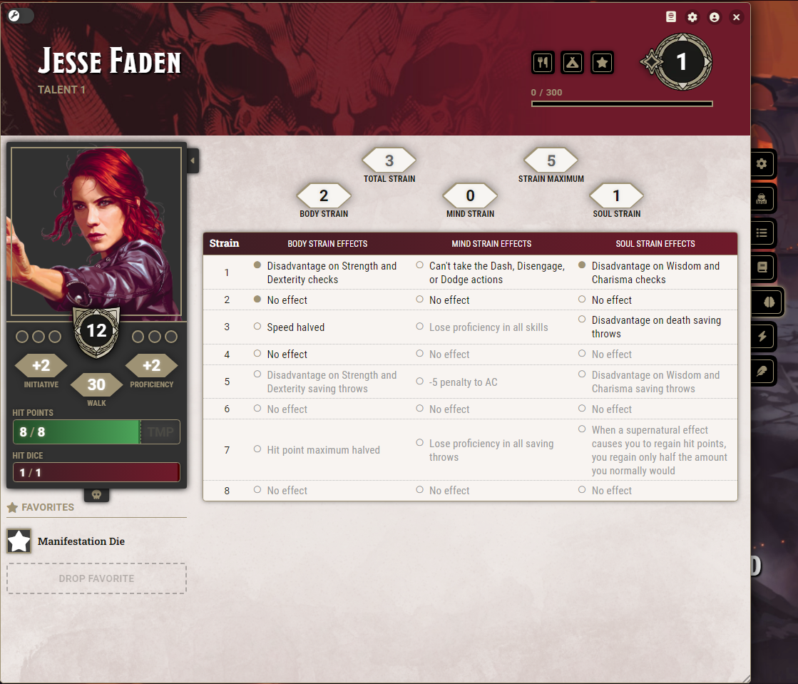

# Talent Character Sheet Support for D&D 5e

This module adds character sheet support for The Talent class from [MCDM's The Talent and Psionics](https://mcdm.gg/Talent) supplement.

Supported character sheets:

* Default D&D 5e (3.0.x)
* [Tidy5e Sheet](https://foundryvtt.com/packages/tidy5e-sheet/) up to version 0.10.1
* Legacy D&D 5e (2.4.x)

Other character sheets are untested and may or may not have formatting issues.

## Psionic Powers as Pseudo-Spells

This module allows you to to manage your Talent's powers as spells. A new spell preparation mode called Talent Power will separate the "spell" from the rest of the spells in your spellbook, and start categorising them under "Orders". Cantrips will become 1st Order powers, and 2nd to 6th Level spells will become 2nd to 6th Order powers. The six power specialties have also been added as spell schools. Manifesting at higher Orders is automatically managed based on your Talent level.

## Strain Tracker

This module also adds a new tab to the character sheet of your Talent for tracking your strain. Your maximum strain is automatically calculated based on your Talent level, and your options for how you would like to apply strain are automatically greyed out based on how much potential strain you have left. Strain can be applied by either ticking the checkbox next to the desired effect, or by ajusting the numbers in the input boxes at the top of each track. Total strain is automatically calculated.

# [Documentation/Frequently Asked Questions](https://github.com/CeaneC/FoundryVTT-Talent/wiki)
